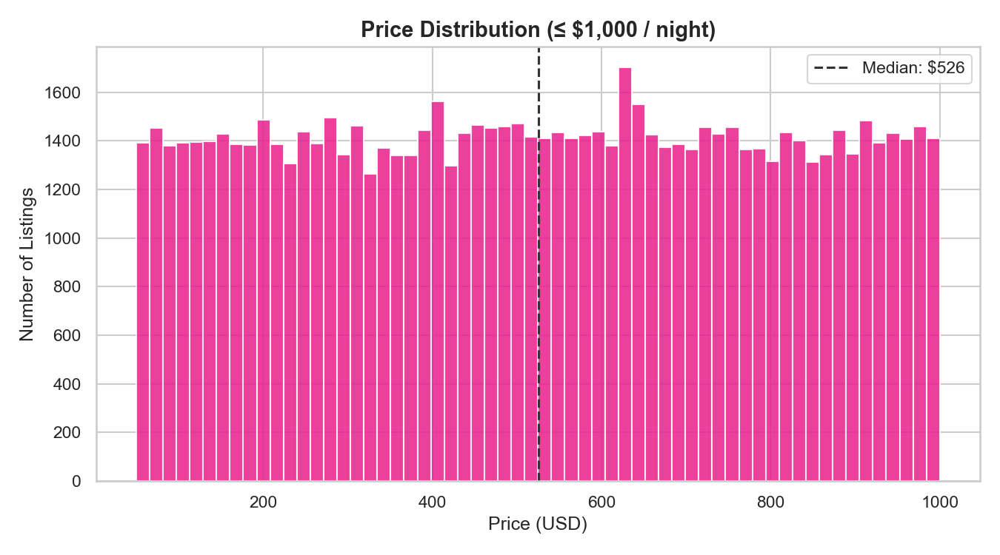
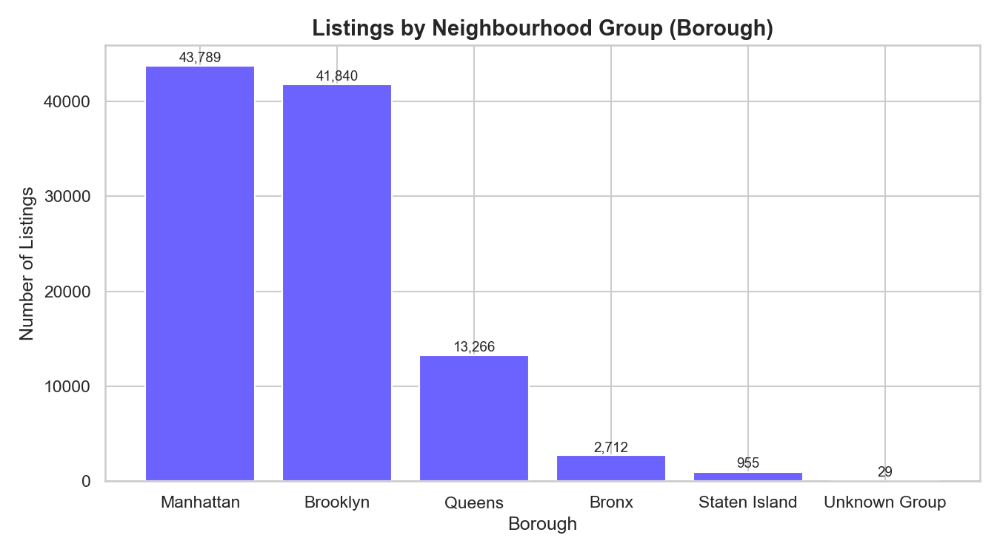
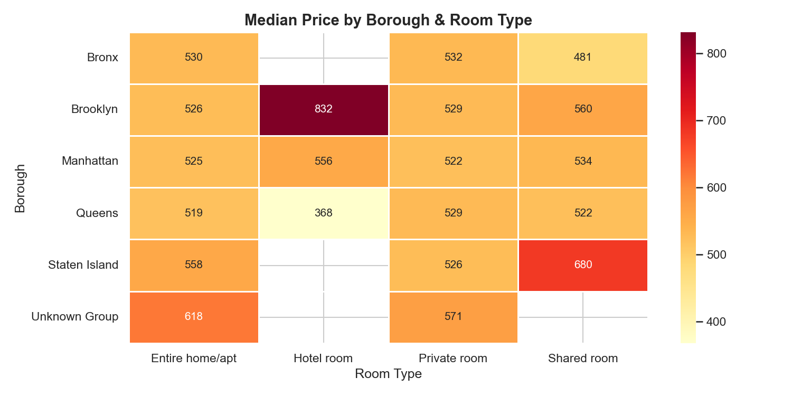
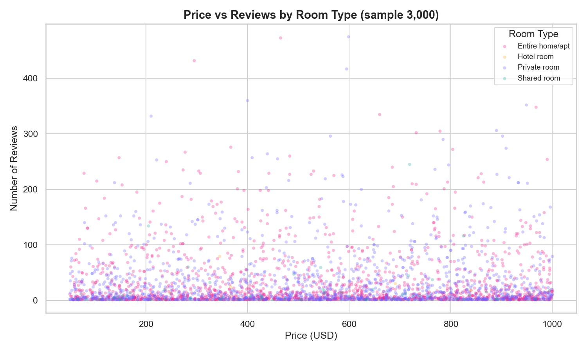
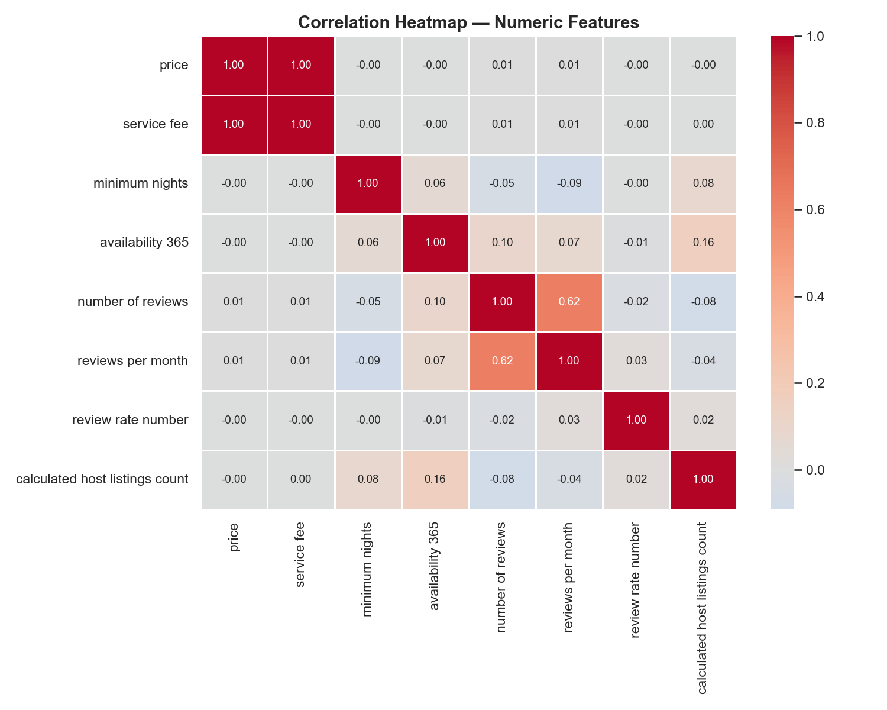

# Exploratory Data Analysis (EDA) Projects

## What is EDA?

Exploratory Data Analysis is the process of investigating a dataset before making any assumptions — cleaning it, summarizing its structure, and visualizing its patterns to understand what the data is actually telling you. It is the foundation of any data science workflow. Before building models, making predictions, or drawing conclusions, EDA ensures you know what you're working with: which variables matter, how they relate to each other, where the data is missing or messy, and where the real signal lives versus noise.

EDA typically moves through four stages:

| Stage | What it does |
|---|---|
| **Preprocessing** | Cleans missing values, fixes typos, converts data types |
| **Univariate Analysis** | Examines one variable at a time — distributions, counts, skew |
| **Bivariate Analysis** | Compares two variables — correlations, group differences |
| **Multivariate Analysis** | Looks at three or more variables together — interactions, combined effects |


## How EDA Answers Business Questions

Raw data doesn't answer questions. EDA does. By carefully exploring the data, you can go from vague curiosity to specific, evidence-backed answers. A few examples of how EDA translates to real decisions:

- **"What drives price?"** → A bivariate boxplot of room type vs. price immediately shows that entire homes command 2x the median price of private rooms. That's a pricing strategy insight for hosts.
- **"Where is demand concentrated?"** → A bar chart of listings by borough reveals that Manhattan and Brooklyn account for the majority of supply, guiding where to focus marketing spend.
- **"Do cheaper listings get more bookings?"** → A scatter plot of price vs. number of reviews (used as a booking proxy) reveals an inverse relationship — lower-priced listings accumulate significantly more reviews, meaning hosts face a volume vs. margin trade-off.
- **"Which segment is most lucrative?"** → A pivot heatmap crossing borough and room type shows exactly which combinations command the highest median prices, pointing investors and new hosts toward the highest-yield market segment.

EDA doesn't just describe the data. It frames the right questions, surfaces hidden patterns, and gives stakeholders a foundation to make data-driven decisions with confidence.

---

## Projects

```
exploratory-data-analysis/
├── AirBNB/        — NYC Airbnb listings: pricing, geography, reviews, availability
├── Yelp EDA/      — Yelp business & review data
└── Employee EDA/  — Employee dataset analysis
```

---

## AirBNB — Sample Visualizations

### Price Distribution
> Most listings cluster under $300/night with a long right tail — median sits around $150.



---

### Listings by Borough
> Manhattan and Brooklyn dominate supply, making them the most competitive and highest-priced markets.



---

### Price by Borough & Room Type (Multivariate)
> Manhattan entire homes are the premium segment. Shared rooms in outer boroughs are the budget floor.



---

### Price vs Reviews by Room Type
> Private rooms and shared rooms cluster at lower prices but higher review counts — more bookings, lower margin.



---

### Correlation Heatmap
> Price and service fee are tightly correlated. Review metrics cluster together, separate from pricing variables.



---

## Tech Stack

- **Python** — pandas, numpy, matplotlib, seaborn
- **Data Source** — Airbnb Open Data via Kaggle
